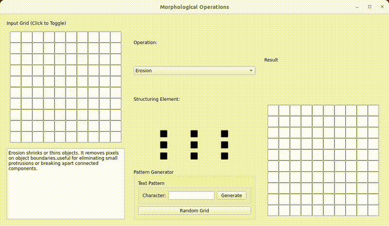

# 🌀 MorphoLogic – Morphological Magic for Images!  



**MorphoLogic** is an interactive and fun way to explore fundamental **morphological operations** in image processing. Play with:  

✅ **Erosion** – Shrink objects in an image  
✅ **Dilation** – Expand objects for better visibility  
✅ **Opening** – Remove small noise while preserving shape  
✅ **Closing** – Fill small gaps for cleaner images  

🎨 **Generate** a binary image from any letter or number and apply these operations **in real time!**  

---

## 🚀 Installation  

```bash
pip install -r requirements.txt
```

## 🎮 Usage
```bash
python main.py
```

## 📜 License
This project is licensed under the MIT License.

⚡ Unleash the power of morphology! Have fun processing images like a pro! 💡🖼️